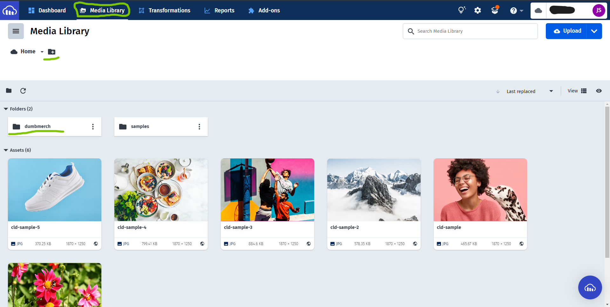

# Cloudinary

`Cloudinary` is a cloud-based image and video management services. It enables users to upload, store, manage, manipulate, and deliver images and video for websites and apps.

Reference: [Offical Cloudinary Website](https://cloudinary.com/documentation/go_integration)

### Prepare

- Login to [cloudinary](https://cloudinary.com/)

* Click `Media Library`

* Create a folder that will be used to store files

  

* Go to `Settings` → `Upload`

* Scroll down to `Upload presets`, Click `Add upload preset` → fill in the form and click `save`

### Server side (backend)

- Install cloudinary

  ```
  go get github.com/cloudinary/cloudinary-go/v2
  ```

- On `uploadFile.go` file delete split `uploads/` code and change `data` variable to `ctx` (on parameter 3)

  > File: `pkg/middleware/uploadFile.go`

  ```go
  data := tempFile.Name()
  // Delete 1 line this below code ...
  filename := data[8:] // split uploads/

  // add data variable to ctx (on parameter 3) ...
  ctx := context.WithValue(r.Context(), "dataFile", data)
  next.ServeHTTP(w, r.WithContext(ctx))
  ```

- On handler `product.go` file

  > File: `handlers/product.go`

  - Import pakcage

    ```go
    "context"
    "github.com/cloudinary/cloudinary-go/v2"
    "github.com/cloudinary/cloudinary-go/v2/api/uploader"
    ```

  - On `CreateProduct` method, modify get image `filename` to `filepath`

    Before

    ```go
    // get image filename
    dataContex := r.Context().Value("dataFile")
    filename := dataContex.(string)
    ```

    After

    ```go
    // get image filepath
    dataContex := r.Context().Value("dataFile")
    filepath := dataContex.(string)
    ```

  - On `CreateProduct` method, declare `context background`, `CLOUD_NAME`, `API_KEY`, `API_SECRET`

    ```go
    var ctx = context.Background()
    var CLOUD_NAME = os.Getenv("CLOUD_NAME")
    var API_KEY = os.Getenv("API_KEY")
    var API_SECRET = os.Getenv("API_SECRET")
    ```

  - On `CreateProduct` method, Add Cloudinary credentials and Upload file to your Cloudinary folder

    ```go
    // Add your Cloudinary credentials ...
    cld, _ := cloudinary.NewFromParams(CLOUD_NAME, API_KEY, API_SECRET)

    // Upload file to Cloudinary ...
    resp, err := cld.Upload.Upload(ctx, filepath, uploader.UploadParams{Folder: "dumbmerch"});

    if err != nil {
      fmt.Println(err.Error())
    }
    ```

  - On `CreateProduct` method, modify store file URL to `database` from `resp.SecureURL`

    ```go
    product := models.Product{
      Name:   request.Name,
      Desc:   request.Desc,
      Price:  request.Price,
      Image:  resp.SecureURL, // Modify store file URL to database from resp.SecureURL ...
      Qty:    request.Qty,
      UserID: userId,
      Category:	category,
    }
    ```

- Make sure modify this below code:

  > File: `handlers/product.go`

  - On `FindProducts` method, `delete` pathfile manipulation

    ```go
    for i, p := range products {
      imagePath := os.Getenv("PATH_FILE") + p.Image
      products[i].Image = imagePath
    }
    ```

  - On `GetProduct` method, `delete` pathfile manipulation

    ```go
    product.Image = os.Getenv("PATH_FILE") + product.Image
    ```

- Add `CLOUD_NAME`, `API_KEY`, `API_SECRET` variable and the values to `.env`

  > File: `.env`

  ```.env
  CLOUD_NAME=your_cloud_name_here...
  API_KEY=your_api_key_here...
  API_SECRET=your_api_secret_here...
  ```
